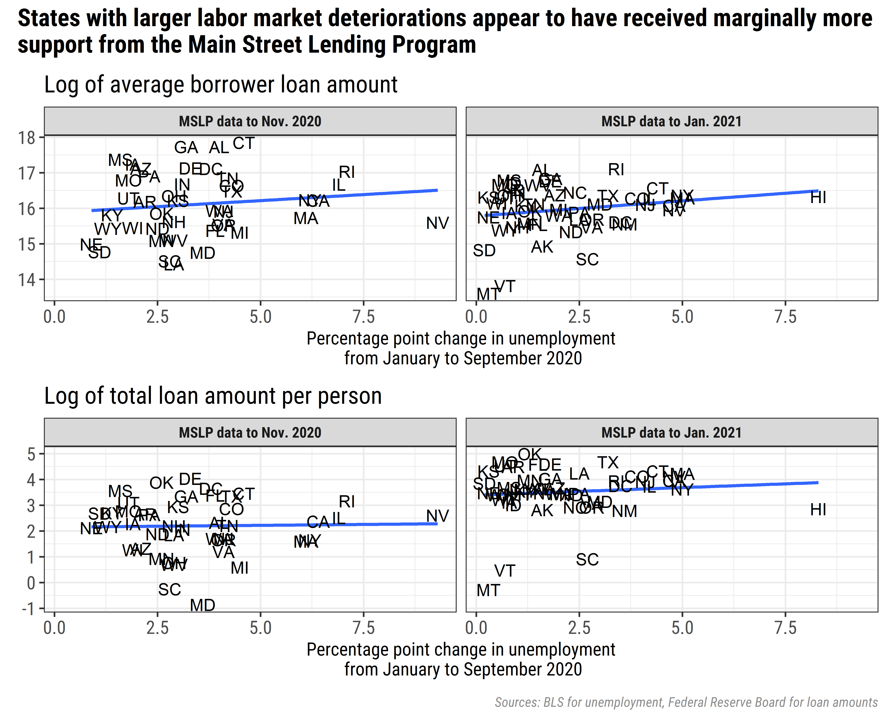

\newpage

```{r setup, include=FALSE}
knitr::opts_chunk$set(echo = FALSE, warning = F, message = F)
```

## Updated Analysis

The original analysis compared Main Street Lending Program (MSLP) data up to November 7th, 2020 to the by-state change in unemployment between January and September 2020 [@mslp-paper]. I update this analysis with revised unemployment data[^1] and the full MSLP data up to January 8th, 2021.

[^1]: Note that I use revised unemployment data both with the MSLP data up to November 2020 and the MSLP data up to January 2021.

Consistent with the original analysis, there appears to be a positive, though marginal relationship between the extent of labor market deterioration in a given state and the amount of MSLP loans flowing to that state, both in terms of average borrower loan size and total loan amount per person.

##  Alternative Methods

While a good first pass, this preliminary analysis may obscure important heterogeneity. In particular, the extent of labor market deterioration in given states evolved throughout the lifetime of the program. Thus, using what essentially amounts to a snapshot in time---the change in unemployment between January and September 2020---masks interesting variation across states and time[^2].

[^2]: This somewhat arbitrary nature is clear when considering that I could have justifiably used the change in unemployment between January 2020 and January 2021 as the measure of labor market conditions in this update, rather than being consistent with the original analysis. While the results change little in practice, it still highlights a potential issue with the snapshot approach.

To ameliorate this, perhaps the most obvious solution would be to use state-month pairs as the unit of analysis, rather than states alone. By using state-month pairs, one can observe the relationship between the extent of labor market deterioration in a given state during a given month and the value of the loans flowing to businesses in that state during that month. Unfortunately, there is a confounding factor: trends over time. Labor market conditions were, generally speaking, improving during the life of the program. At the same time, the number of loans, the average size of loans, and the total value of loans were also increasing. Thus, one may consider another option, such as a simple difference in difference approach, to control for both state and time fixed effects. For example, one could:

-   Calculate, for each state, the average difference in state-level versus national-level unemployment in 2019 to approximate a normal difference for each state (control for state fixed effects).
-   Calculate the difference in state versus national-level unemployment for each state-month pair during the MSLP program (control for the trend in the national environment over time).
-   Calculate the difference between the difference in normal times and the difference in each month during the life of the MSLP program.

This difference in difference variable reveals whether, in a given month, a given state has worse unemployment compared to the national situation than it has in "normal times" (proxied by 2019).

The relationship between this difference in difference value and average borrower loan size is positive, providing more evidence of a positive relationship between deterioration in labor market conditions and MSLP support. However, it is *negatively* correlated with the total value of the loans per person (though the relationship is weak). This contradicts the findings of the snapshot approach, and warrants further analysis.

A simpler alternative would be to use the change in the unemployment rate month-over-month for each state as the measure of labor market stress. This measure has a positive correlation with the total value of loans per capita, but essentially no relationship with the average loan size---the opposite of the difference in difference approach. This sensitivity across measures raises robustness concerns, and itself warrants more exploration.

Still another robustness check would be to employ a different labor market indicator altogether, since much has been written about the unique nature of the pandemic recession [@kochhar_bennett_2021], and since, even in normal times, relying on any single measure to capture labor market conditions is problematic [@powell2020]. One such alternative is the Employment to Population ratio (EPOP). EPOP in particular is useful in this context given the number of people forced out of the labor market during this recession who did not necessarily qualify as "unemployed" under the strict definition. For example, mothers who were forced out of the labor market to take care of children, or older workers who stayed on the sidelines due to health concerns [@johnson_2021].

I conducted the same analyses as above using monthly EPOP data for each state from the Bureau of Labor Statistics Local Area Unemployment data. Reassuringly, the results and implications are broadly similar: there is some evidence that harder hit states received more support from the MSLP, but this relationship is sensitive to methodology, and there is considerable noise in the data.

## Pulse Survey Data

Although beyond the scope of this labor-market-focused analysis, it is worth considering that there may be an even more direct relationship between business conditions and use of the MSLP. To test this, I use the Small Business Pulse Survey data from the Census Bureau and focus on the question "overall, how has this business been affected by the COVID-19 pandemic?" Specifically, I test the relationship between the month over month change in the percent of businesses in a given state replying there was a "moderate" or "large" negative impact on their business to the amount of MSLP loans flowing to that state during that month. As expected, the relationship is positive, suggesting that states with worsening business conditions received more support from the MSLP.

This is only one of dozens of potentially relevant Small Business Pulse Survey questions that could be compared to MSLP support. Questions about cash on hand, changes in employment, and shutdown effects could all be informative. This is an area ripe for further investigation.

## Conclusion

Considering measures like unemployment and the employment to population ratio, and using snapshot, difference in difference, and month over month methods reveals evidence of a positive relationship between deterioration of labor market conditions and use of the Main Street Lending Program. However, the relationship is sometimes marginal, and is sensitive to the measure and methods used. Another area to explore would be the direct relationship between (self-reported) business conditions and use of MSLP loans. The Small Business Pulse Survey is an exceptional resource for this purpose.

\newpage

## References
